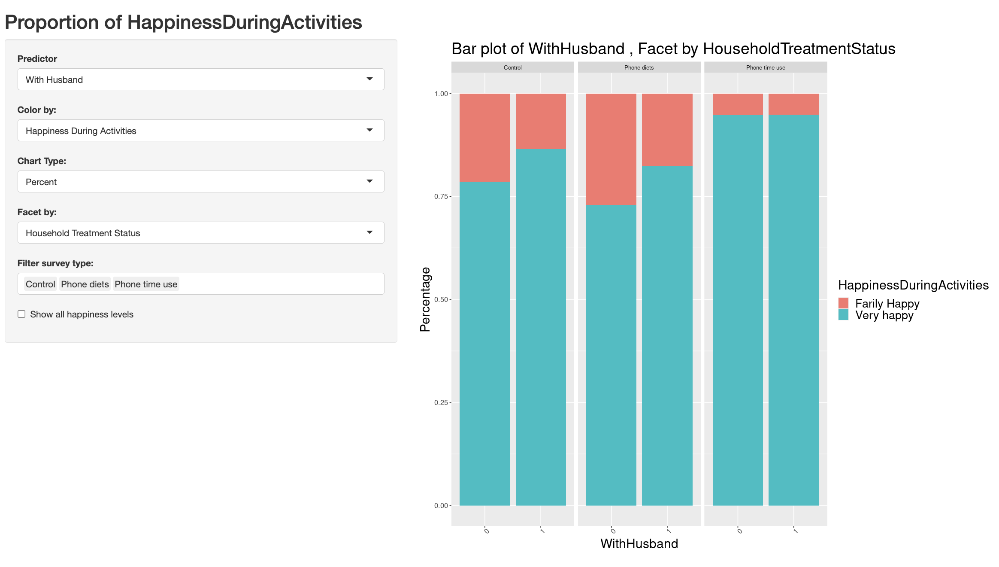

# Development Economics Research in Rural Ethiopia
## Introduction
This project aimed to visualize and analyze the factors that influence the happiness of women in rural villages in Amhara, Ethiopia. The data we used was from Professor Tamara McGavock’s (Grinnell College Department of Economics) research paper: “Her Time: A Time Use Study of Women Participating in Livelihoods Programs in Ethiopia”. Our research focused on the reported “happiness level” of each woman. In particular, we wanted to identify if the happiness was impacted by the presence of their husband. Please check [Report](/Report.docx) for more details.

Authors: Aleph Aseffa, Huandong Chang, Haruko Okada

Supervisor: Shonda Kuiper (Grinnell College Department of Statistics)

## Data
After a series of data restructure and data cleaning, we decided to focus on the following variables:
- Vesa: Code that identifies the VESA (Village Economic and Social Associations; local community groups) that the respondent belongs to.
- CompanionDuringActivity: Was there anyone with the respondent (1 or 0).
- PrimaryActivityMainCategory: What category their primary activity during this time period falls into.
- SecondaryActivityMainCategory: What category their secondary activity during this time period falls into.
- MainLocationDuringTimePeriod: Where the respondent was for the majority of this time period.
- CaringForChild: If the respondent is caring for a child (1) or not (0).
- WithHusband: If the respondent is with her husband (1) or not (0).

## Interactive Visualization
[Interactive Shiny App](https://huandongchang.shinyapps.io/WomenHapiness/) and [App Instructions](/App_Instructions.docx)

Example: To explore how the WithHusband differs among the different household treatment statuses, we generated the following graphs. 
 

## Methodology
This dataset consisted of three distinct survey types:
-	CC (Control): Respondents are asked questions in in-person interviews.
-	PT (Phone Time Use Treatment): Respondents receive 5 phone calls per day, and are asked about their primary and secondary time use activities
-	PD (Phone Diets Treatment): Respondents are asked questions in in-person interviews.

We constructed one model for each household treatment status (i.e. CC, PD, PT), and one for the entire dataset (ALL), where PT is based on phone calls and CC and PD are based on recalls.

In each of these four models, we analyzed whether the presence of the husband affected self-reported happiness levels. For each model, we first create a reduced model including all main effect variables and their interaction terms, except for the WithHusband variable. We then conducted a Likelihood Ratio tests (LRT) on the WithHusband variable, allowing us to determine whether or not it had a significant impact on Happiness, after accounting for all other variables in the model. It is important to recognize that since all other variables were tested multiple times, their p-values can be very unreliable.

## Conclusion
We found that the WithHusband variable was significant for the CC (p-value < 0.0001), PT(p-value < 0.0001), and ALL (p-value < 0.0001), models, while it was insignificant for the PT  (p-value = 0.65) model. While our analysis stops at uncovering the differences between these household treatment statuses, we believe that this result provides further evidence that the survey method influences the answers of respondents. 

